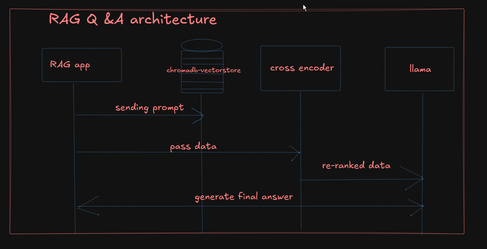
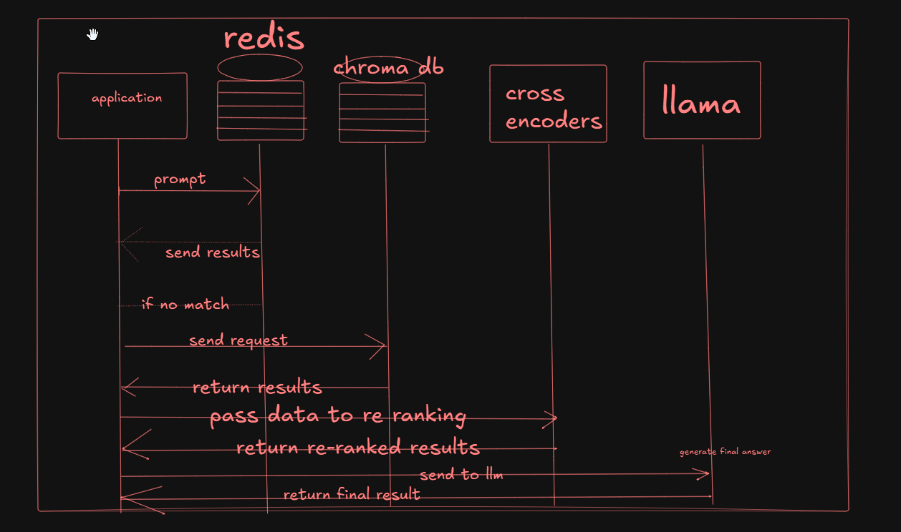

# 📑 RAG Question Answering


## Architecture of RAG Question Answering 
 
 

## Prerequisites
    - ollama
    - chromadb
    - streamlit 
    - langchain-community
    - Redis
    - sentence-transformers
    - PyMuPDF

##  Setting up locally

```sh
git clone <git-url>
```

##  Install dependencies

```sh
pip install -r requirements.txt
``` 

## make sure langchain-redis is running in docker 

```sh
docker run -d -p 6379:6379 redis/redis-stack:latest
```

## Running the application

```sh
streamlit run app.py
```

## Testing 
### install requirements 
```sh
pip install pytest

pytest test_rag.py -v

```